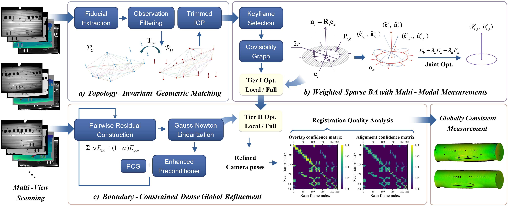

## Dual-Tier Opt. for Accurate and Real-Time Measurement of Large-Scale Surfaces




## 1. Licenses
The source code is released under [GPLv3](http://www.gnu.org/licenses/) license. If you use DTO-AR in an academic work, please cite:
  
    @article{DTO-AR_TIM,
      title={Dual-Tier Optimization for Accurate and Real-Time Mobile Structured-Light Measurement of Large-Scale Surfaces},
      author={Bowen Li, Ze Yang, Yanbiao Sun, and Jigui Zhu},
      journal={IEEE Transactions on Instrumentation and Measurement}, 
      volume={},
      number={},
      pages={},
      year={}
     }

## 2. Prerequisites

DTO-AR is built on Windows x64 with Visual Studio 2022 (C++11) and CMake 3.20 or later. Install the following dependencies:

- **OpenCV** (3.x or 4.x) and **Eigen3** (3.1.0 or later) for image processing and linear algebra.
- **Pangolin** and **OpenSceneGraph** for SLAM and point-cloud visualization.
- **Boost.Serialization** for map serialization.
- **NVIDIA CUDA Toolkit** for GPU-accelerated dense optimization.
- **Photoneo PhoXi Control / SDK** for structured-light acquisition.

DBoW2, g2o, Sophus, and hashlibpp are included in Thirdparty/ and integrated through CMake. Use compatible x64 dependencies; the Release build uses the static MSVC runtime (/MT). Running DTO-AR requires a CUDA-capable NVIDIA GPU. Online acquisition uses a Photoneo scanner; other mobile structured-light scanners can be supported by adapting the acquisition interface and input data format.

## 3. Building DTO-AR library and demo

After installing the dependencies, add CMake to your `PATH` and run the following commands from the repository root:

```powershell
cmake -S . -B build -G "Visual Studio 17 2022" -A x64
cmake --build build --config Release --target rgbd_tum --parallel 4
```

Set dependency paths in CMake to match your installation. The GPU architecture defaults to `86`; specify `-DDTO_AR_CUDA_ARCHITECTURE=<compute capability>` when configuring for another GPU.

Before running, please make the dependency DLLs available through `PATH` or beside the executable, and prepare the camera configuration file.

Run the demo from the repository root, with online or offline mode selected in the settings file:

```powershell
# Online acquisition
.\bin\rgbd_tum.exe "path_to_vocabulary" "path_to_settings"

# Offline processing
.\bin\rgbd_tum.exe "path_to_vocabulary" "path_to_settings" "path_to_sequence" "path_to_association"
```

## 4. Credits
Many thanks to [ORB-SLAM3](https://github.com/UZ-SLAMLab/ORB_SLAM3) and [BundleFusion](https://github.com/niessner/BundleFusion). Our system is primarily based on the first project, with some implementation details adapted from the second project.
